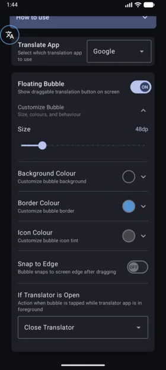
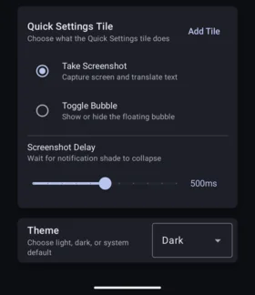

# phamd's Fork

This is a fork with additional features listed below.

<table style="border: none; border-collapse: collapse;">
<tr style="border: none;">
<td valign="top" width="65%" style="border: none;">

### Floating Bubble
- Added floating bubble overlay as an alternative to the Quick Settings tile
- Tap bubble to translate, long-press to open settings
- Drag to reposition anywhere on screen
- Bubble Customization (size, colour, snap)

### Translator Dismiss Action
- Configurable action when bubble is tapped while translator is open:
  - Nothing - take another screenshot
  - Go Back - press back button
  - Go Home - return to home screen
  - Close Translator - kill then return home
- Requires "Usage Access" permission if enabled

### Settings UI Improvements
- Reorganized settings layout with descriptions
- Proper Material 3 dropdown menus

</td>
<td width="35%" align="center" valign="middle" style="border: none;">

</td>
</tr>
<tr style="border: none;">
<td valign="top" style="border: none;">

### Quick Settings Tile
- Tile action mode selection:
  - Take Screenshot - capture and translate (default)
  - Toggle Bubble - show/hide the floating bubble
- "Add Tile" button to add the tile instead of forced prompt

</td>
<td align="center" valign="middle" style="border: none;">

</td>
</tr>
</table>

---

> [!NOTE]
> **Below is the original project documentation.**

---

# Screen Translator

> This Android app is a Quick Setting tile to translate the current screen using Naver Papago (네이버 파파고) / Google Lens app.

## Demo

https://user-images.githubusercontent.com/23007879/163716868-2f5020cc-e247-4208-98ac-e1ff01d14a61.mp4

Notice that using the Screen Translator app is much quicker than the traditional screenshot and share UI.

## How does it work?

1. When user touches the quick settings tile, an intent is sent by `ScreenTranslatorTileService::onClick` to trigger `ScreenTranslatorAccessibilityService::onStartCommand`
2. If the user didn't give accessibility permissions yet, they are <u>redirected to accessibility settings page</u>.
3. If the accessibility permissions are present, notification panel collapse request is send to system.
4. Finally, a <u>screenshot is taken</u> using accessiblity service and sent to the translate app for further translation inside their app's activity.
5. If the translate app app is not installed in the system, user is notified of the same through a toast.

This app has a UI for a few settings too.

## Author

Satti Vamsi Krishna Reddy - [vamsi3](https://github.com/vamsi3)

## License

This project is licensed under the MIT License - please see the [LICENSE](LICENSE) file for details.

## Disclaimer

DeepL, DeepL Translator and all related logos are trademarks of DeepL SE or its affiliates.

Google, Google Lens™ visual search engine and all related logos are trademarks of Google LLC or its affiliates.

NAVER, Papago and all related logos are trademarks of NAVER Corporation or its affiliates.
